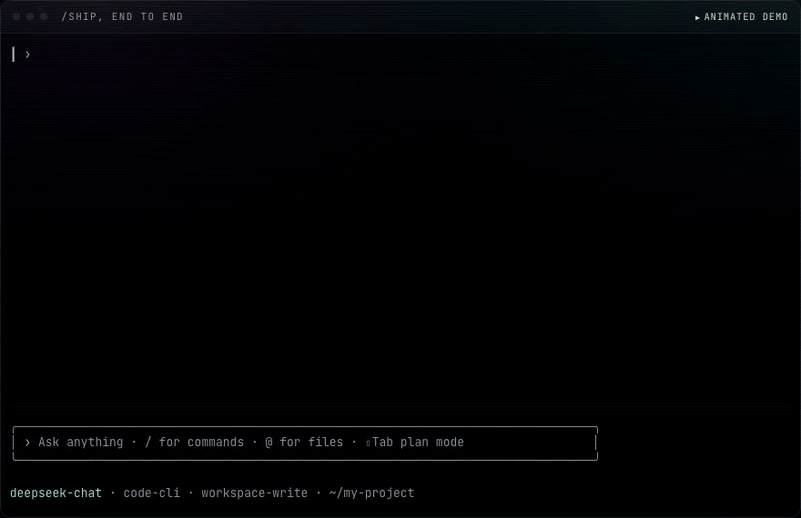

<p align="center">
  <a href="https://blackman99.github.io/codsh/">
    
  </a>
</p>

<p align="center">
  <a href="https://blackman99.github.io/codsh/"><b>Site</b></a> ·
  <a href="https://www.npmjs.com/package/codsh-cli">npm</a> ·
  English | <a href="README.zh.md">中文</a>
</p>

> npm: [`codsh-cli`](https://www.npmjs.com/package/codsh-cli) · command: `codsh`

A terminal coding agent on the [DeepSeek Harness](https://github.com/deepseek-ai/deepseek-harness). **`/ship`** takes one sentence to verified code.

## Install

```sh
npm install -g @deepseek-ai/dsh codsh-cli   # already have dsh? npm i -g codsh-cli
codsh
```

Zero-dependency launcher. `codsh` is `dsh --profile code`. Key: `DEEPSEEK_API_KEY`.

`codsh --resume <id>` · `codsh --continue` · `codsh -p "task"`

Or skip the launcher:

```sh
dsh plugin --profile code add codsh-bundle
dsh --profile code
```

## `/ship`

[](https://blackman99.github.io/codsh/)

`/ship <one-sentence idea>` — two approvals, then autonomous:

1. **Interview** — reads the repo, one question at a time.
2. **Spec** — you confirm. Each criterion names its proving command.
3. **Plan** — you approve. Baseline runs before any code.
4. **Landing** — the spec file is memory; each green milestone is a commit.
5. **Done** — every criterion re-run and reported.

Bare `/ship` resumes an unfinished spec.

```sh
/ship let long diffs open in a pager instead of scrolling past
```

## The surface

The [site](https://blackman99.github.io/codsh/) shows each live. In brief:

- Alternate screen; box pinned at the bottom; quit restores your shell.
- Long blocks fold; click one, Ctrl+O all; hover names it.
- Todos stay in chrome (Ctrl+T / `/todos`).
- Drag to copy. Markdown, thinking, and tool cards stream in.
- Ctrl+V pastes images (native vision, or a file + optional sidecar).
- `/` commands, `$` skills, `!` shell, `@` files — menu sits above the box.
- Approvals and `/model` `/resume` are arrow-key widgets. ⇧Tab is plan mode.
- `/clear`, `/resume`, Esc Esc, `/init`. `!cmd` prints in-session and the agent sees it.

Off a TTY it becomes a line reader: no widgets, no drawing.

## Development

```sh
pnpm install
pnpm run dev                 # build → .dev-home → boot
MOCK=markdown pnpm run dev   # keyless, against the e2e mock
pnpm test
pnpm run test:e2e            # pack, install, drive the real binary
```

`pnpm run sync:dsh` tracks published `@deepseek-ai/dsh-*` releases. This repo never forks the harness.

## License

MIT
