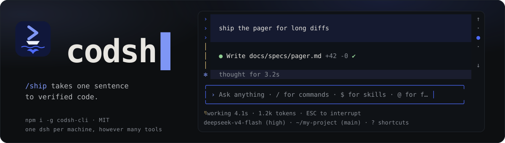

<p align="center">
  <a href="https://blackman99.github.io/codsh/">
    
  </a>
</p>

<p align="center">
  <a href="https://blackman99.github.io/codsh/"><b>Site</b></a> ·
  <a href="https://blackman99.github.io/codsh/gallery.html">Gallery</a> ·
  <a href="https://www.npmjs.com/package/codsh-cli">npm</a> ·
  English | <a href="README.zh.md">中文</a>
</p>

<p align="center">
  <a href="https://www.npmjs.com/package/codsh-cli"></a>
  <a href="https://github.com/Blackman99/codsh/blob/main/LICENSE"></a>
  <a href="https://github.com/topics/dsh-plugin"></a>
  <a href="https://dshfind.com/en/plugins/Blackman99/codsh?ref=badge"></a>
  <a href="https://github.com/awesome-dsh-plugin/awesome-dsh-plugin"></a>
</p>

> npm: [`codsh-cli`](https://www.npmjs.com/package/codsh-cli) · command: `codsh`

**codsh** is an autonomous terminal coding agent for DeepSeek — and any OpenAI-compatible endpoint — built directly on the [DeepSeek Harness](https://github.com/deepseek-ai/deepseek-harness) (dsh). Not a fork.

Its flagship feature, **`/ship`**, turns a one-sentence idea into fully verified code through an autonomous 7-stage engineering pipeline, with a built-in live task flow panorama across terminal and browser.

Want to see what it builds? [Visit the gallery](https://blackman99.github.io/codsh/gallery.html) for real projects, screenshots, and playable results. Every project was built from a **one-sentence request**, with just **one round of interaction** and the **recommended answer selected for every question**.

## Install

```sh
npm install -g @deepseek-ai/dsh codsh-cli
export DEEPSEEK_API_KEY="your-api-key"
codsh
```

Common flags:
- `codsh -p "task"` — Run a non-interactive task directly
- `codsh --continue` — Continue the last session
- `codsh --resume <id>` — Resume a specific session
- `codsh update` — Update launcher and profile runtime

## `/ship`: One Sentence to Verified Code

```sh
/ship let long diffs open in a pager instead of scrolling past
```

`/ship` automates the complete engineering workflow from idea to delivery:

1. **Pre-flight** — Checks git working tree state and creates an isolated `ship/<slug>` branch.
2. **Wayfinder** — Clarifies core goals, constraints, and trade-offs.
3. **Grill** — Interactive design interview with smart, recommended defaults.
4. **Spec (Gate 1)** — Formulates user stories, public seams, and explicit Out of Scope boundaries.
5. **Tickets (Gate 2)** — Decomposes work into vertical slices structured as an explicit dependency DAG.
6. **Landing** — Dispatches tickets into parallel Git worktrees for TDD implementation and continuous integration.
7. **Done** — Verifies acceptance criteria, ensures zero repo regressions, and merges back cleanly.

### Live Task Flow Panorama
- **Live TTY Teaser**: Pinned status row showing real-time ticket counts (`待认领 n · 已认领 n · 已关闭 n`), in-flight parallel landing worktrees, and the Web flowchart URL.
- **ASCII DAG Overlay (`Ctrl+G`)**: Instant fullscreen terminal visualization of task dependencies and claim states.
- **Local Web Flowchart**: Interactive React Flow map (`127.0.0.1:<port>`) with decision context, recorded Q&As, and landing tickets.

### Autonomous Resilience
- **Automated Conflict Resolution**: Git merge conflicts (including lockfiles and renames) are autonomously resolved by agent sub-tasks with validation retries.
- **Pause & Resume**: `Ctrl+C` safely pauses coordination; running a bare `/ship` resumes unfinished work from where it left off.

## The surface

Designed for high-efficiency, keyboard-driven terminal development:

- **Clean Terminal UI**: Full-screen alternate buffer; input stays pinned at the bottom; restores your shell cleanly on exit.
- **DeepSeek Blue Themes**: `/theme` opens a picker that previews each theme live (arrows preview, `Enter` saves, `Esc` reverts); `/theme <name>` switches directly. `auto` (default) follows the terminal's light or dark background with `deepseek` / `deepseek-light`; `terminal` paints only your terminal's own sixteen colours, with no backgrounds. The choice is saved in `$DSH_HOME/code-cli-ui.json`; `CODSH_THEME=<name>` overrides it for one launch.
- **Foldable Reasoning**: Streaming thoughts collapse into a single line (`Ctrl+O` or click to expand/collapse).
- **Subagent Matrix**: Background and parallel subagents run in isolated views (`Ctrl+H` to list, click/enter to inspect, `Esc` to return).
- **Todos That Keep Up**: The agent's todo list stays pinned above the status row (`Ctrl+T` or a click opens it whole). When the agent makes 20 tool calls with an open list unchanged, or a compaction drops the list from its context, codsh shows the model its list again so the pinned item follows the real work. `CODSH_TODO_REMINDER=<calls>` changes the count for one launch; `off` turns the reminder off.
- **Timeline Navigation**: Jump between dialogue turns (`Shift+←/→`, `/jump`) or branch off from an earlier turn (`/rewind`).
- **Shortcuts & Controls**:
  - `Shift+Tab`: Toggle plan mode
  - `Ctrl+Q`: Queue input while the agent is running
  - Settings and view commands (`/theme`, `/model`, `/effort`, `/thinking`, `/ui`, `/permission`, `/plan`, `/status`, `/view`, `/diff`, `/copy`, `/jump`, …) take effect at once, even mid-turn — they are never queued; a model or thinking switch applies from the running turn's next step
  - `Ctrl+C`: Interrupt current execution
  - `Ctrl+V`: Paste images directly from clipboard
  - `/view`, `/diff`, `/copy`: Inspect files, uncommitted changes, or code blocks in a dedicated pager

## Third-party endpoints

Connect to any OpenAI-compatible gateway by adding an `llm-pi-ai` entry to the `code` profile's own patch layer, `$DSH_HOME/profiles/code/cordis.patch.yml` (default `~/.dsh/profiles/code/cordis.patch.yml`), which applies after every bundle:

```yaml
- id: llm-pi-ai
  config:
    providers:
      acme-gateway:
        displayName: Acme Gateway
        apiKeyEnv: ACME_GATEWAY_API_KEY
        api: openai-completions
        baseURL: https://gateway.acme.example/v1
        compat:
          thinkingFormat: deepseek
          supportsDeveloperRole: false
          maxTokensField: max_tokens
        models:
          - id: acme-large
            contextWindow: 65536
            maxTokens: 4096
```

A `$DSH_HOME/settings.yaml` from an earlier dsh is imported once on the next start and renamed `settings.yaml.imported`; edit the profile patch from then on.

Switch and persist default model:
```sh
/model acme-gateway/acme-large
```

API keys resolve in order: specified environment variable → `$DSH_HOME/.credentials.yaml` → `<cwd>/.env` → `$DSH_HOME/.env`.

## How it works

`codsh` is a zero-dependency launcher that finds your local `dsh`, registers [`codsh-bundle`](https://www.npmjs.com/package/codsh-bundle) into a `code` profile, and boots `dsh --profile code`.

codsh needs dsh 0.2.0-rc.2 or newer; the launcher refuses an older `dsh` and prints the command that installs a new enough one. The `code-cli` agent preset ships inside the bundle as a dsh preset declaration (`presets/code-cli.patch.yml`). dsh 0.1.7 stopped reading presets from directories, so a copy an earlier codsh left in `$DSH_HOME/.agent-presets/code-cli` is no longer used.

To run directly via dsh:
```sh
dsh plugin --profile code add codsh-bundle
dsh --profile code
```

## Terminals

| Tier | Terminals | Support Level |
|---|---|---|
| First-class | iTerm2, Terminal.app, VS Code, tmux, Windows Terminal + WSL | Release-blocking compatibility |
| Second-class | Ghostty, kitty, Alacritty, Warp | Fully supported; regressions handled as bugs |
| Best-effort | Native Windows (pwsh) | Basic TTY support; persistent PTY unavailable |

Supports Kitty keyboard protocol, focus reporting, OSC 11 color detection (picks the light or dark theme), OSC 12 cursor color (the theme's accent, restored on exit), and terminal image rendering where available.

## Development

See [CONTRIBUTING.md](CONTRIBUTING.md).

```sh
pnpm run dev          # Start local development surface
pnpm test             # Run unit tests
pnpm run typecheck    # TypeScript typecheck
pnpm run test:e2e     # Run E2E tests
```

## Feedback

Bugs, feature requests, or migrating from Claude Code / Cursor? Open an [issue](https://github.com/Blackman99/codsh/issues) or join the [Discussions](https://github.com/Blackman99/codsh/discussions).

## License

[MIT](LICENSE)
