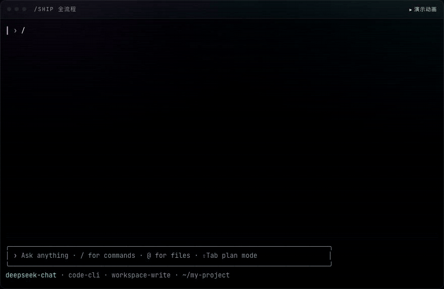

<p align="center">
  <a href="https://blackman99.github.io/codsh/zh.html">
    
  </a>
</p>

<p align="center">
  <a href="https://blackman99.github.io/codsh/zh.html"><b>站点</b></a> ·
  <a href="https://www.npmjs.com/package/codsh-cli">npm</a> ·
  <a href="README.md">English</a> | 中文
</p>

> npm：[`codsh-cli`](https://www.npmjs.com/package/codsh-cli) · 命令：`codsh`

**`/ship`** 把一句话变成已验证的代码。架在 [DeepSeek Harness](https://github.com/deepseek-ai/deepseek-harness) 上的终端编码 agent。

[](https://blackman99.github.io/codsh/zh.html)

## 安装

```sh
npm install -g @deepseek-ai/dsh codsh-cli   # 已有 dsh？npm i -g codsh-cli
codsh
```

零依赖启动器。`codsh` 即 `dsh --profile code`。密钥：`DEEPSEEK_API_KEY`。

`codsh --resume <id>` · `codsh --continue` · `codsh -p "任务"` · `codsh --version` · `codsh update`

有新版本时会话里会有一行提示。`codsh update` 在 shell 里升级，`/update` 在会话里升级，
两条路都会把 code profile 里的配套 runtime 一并升好——只有裸 `npm install -g codsh-cli` 落下的 runtime 才由下次启动补注册。
`CODSH_UPDATE_CHECK=off` 关掉自动检查；主动问依然会问。

不用启动器：

```sh
dsh plugin --profile code add codsh-bundle
dsh --profile code
```

## `/ship`

`/ship <一句话需求>` —— 先 grill，两次确认，此后自主：

1. **Grill** —— 设计树访谈；事实自己查，每轮问当前 frontier，并给出推荐答案。
2. **Spec** —— 自动合成（to-spec）。你确认。每条标准写明证明它的命令。
3. **Tickets** —— 自动切成可独立验证的垂直切片。你批准。写代码前先跑基线。
4. **落地** —— 在 spec 记下的 seam 上 TDD；每个变绿的 ticket 提交一次。
5. **完成** —— 每条标准重跑并汇报。

裸 `/ship` 会续跑未完成的 spec。

```sh
/ship 让超长 diff 用分页器打开而不是刷屏滚过
```

## 界面

[站点](https://blackman99.github.io/codsh/zh.html)上每一屏都是实机抓取。一句话：

**读一段长会话**

- 刚提交的提问占住视口顶部，回复从下方填进空出来的位置。往回读历史再回来，回来的是同一帧——滚轮和 PgDn 都落得回去。
- 不管读到哪里，问出这段内容的那条提问会吸附在顶部；下一条提问再把它推走。
- 右侧一列时间线标出当前在第几轮——刻度和箭头可点击跳转，悬停预览真实的提问内容。Shift+←/→ 是键盘上的同一件事，`/jump` 则是可搜索、可撤回的预览。
- 思考和长工具输出可折叠：点一块开一块，Ctrl+O 开合全部；手动开合的选择跨轮次保留。写完的回答始终整段留下。
- `/view 1` 把一条回答摊成整屏，`/view 1:1` 打开它的第一个代码块；Esc 原样还回会话。`/copy` 用的是同一套编号——原始 Markdown，或去掉围栏的代码。
- `/diff` 把未提交的改动送进同一个阅读器，而不是让它刷过去；装不下自己的 diff 卡片，点一下也在那里打开。管道里它依然只是若干行。

**干活**

- 备用屏幕；输入框钉底；退出原样还回你的 shell。
- todo 常驻 chrome（Ctrl+T / `/todos`）。Markdown、思考、工具卡片流式画出。拖选即复制，对话和输入框都是。
- Ctrl+V 粘贴图片（原生视觉；DeepSeek 文本模型自动借用 Vision Exp；其他文本路由仍落盘并可选 sidecar）。
- `/` 命令、`$` skill、`!` shell、`@` 文件 —— 菜单在输入框上方。⇧Tab 是 plan 模式。
- 审批、`/model`、`/resume` 用方向键；还有 `/clear`、Esc Esc、`/init`、`/update`。`!cmd` 打在会话里，agent 看得到输出。
- 人不在窗口时，等待决定或一轮超过十秒结束会响铃并发桌面通知：iTerm2、WezTerm、Ghostty、kitty、Windows Terminal 走 OSC 9，Terminal.app 走 `osascript`，其它 Linux 终端再加 `notify-send`；窗口有焦点时什么都不发。`bell` 和 `notify` 是两个开关。
- 审批会点名这次调用——`Allow bash: git push origin main?`——第三个答案把它记下来：`bash(git push *)` 写进 `.dsh/permissions.local.json`（个人文件，请加入 gitignore），同一前缀在这个项目里不再询问。`.dsh/permissions.json`（可提交）和 `~/.dsh/permissions.json` 手写，形如 `{ "allow": ["tool", "tool(prefix *)", "tool(exact command)"] }`；复合命令——`&&`、`;`、`|`、换行——永远不匹配前缀。

非 TTY 降级为行读取器：无组件、不绘制。

## 终端

三个等级决定一次发版不能破坏什么：

| 等级 | 终端 | 含义 |
|---|---|---|
| 一等 | iTerm2、Terminal.app、VS Code 集成终端、tmux、Windows Terminal + WSL | 这里出回归就不能发版 |
| 二等 | Ghostty、kitty、Alacritty、Warp | 这里出回归是 bug，不阻塞发版 |
| 尽力支持 | 原生 Windows（pwsh） | 持久终端在那里不可用；其余功能应当可用 |

协议是渐进使用的：kitty 键盘协议、焦点上报、OSC 11 主题探测都会发出请求，终端答应了就生效；不答应的终端走传统路径。

## 第三方端点

任何 OpenAI 兼容端点都是一条 dsh 路由。在 `$DSH_HOME/settings.yaml`（默认 `~/.dsh/settings.yaml`，热加载）里声明一次，然后用 `/model` 选中：

```yaml
llm-pi-ai:
  providers:
    acme-gateway:
      displayName: Acme Gateway
      apiKeyEnv: ACME_GATEWAY_API_KEY
      api: openai-completions
      baseURL: https://gateway.acme.example/v1
      compat:
        thinkingFormat: deepseek      # 思考等级在线上的写法
        supportsDeveloperRole: false  # 系统提示用 system 而不是 developer 角色
        maxTokensField: max_tokens
      models:
        - id: acme-large
          contextWindow: 65536
          maxTokens: 4096
```

`/model acme-gateway/acme-large` 切换过去并保存为默认；`/status` 会显示当前路由。密钥按请求解析，顺序是：指定的环境变量、`$DSH_HOME/.credentials.yaml`、`<cwd>/.env`、`$DSH_HOME/.env`。网关拒绝请求形状时看 `compat`：完整的开关表、按模型的 `reasoningEfforts`（含 `false`，表示这个模型永远不收思考字段）以及修正单个目录模型的 `modelOverrides`，都在 `@deepseek-ai/dsh-llm-pi-ai` 的 README 里。

## 开发

```sh
pnpm install
pnpm run dev                 # build → .dev-home → 启动
MOCK=markdown pnpm run dev   # 无 key，对着 e2e mock
pnpm test
pnpm run test:e2e            # 打包、安装，驱动真实二进制
CAPTURE_SCREENS=1 pnpm run site:screens   # 重拍站点上的终端截屏
```

`CODSH_TRACE=<路径>` 把视口写出的每一个字节、以及当时的窗口尺寸,一并录进文件。
画面错乱是「本 surface 发出的字节」和「终端拿它做了什么」之间的分歧,而前一半事后
就找不回来了;把文件回放进任意终端模拟器,就能还原它画出的屏幕。不设该变量则不开启。

`pnpm run sync:dsh` 跟踪已发布的 `@deepseek-ai/dsh-*`。本仓库绝不 fork harness。

## 许可

MIT
